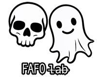

# RObjkt - Referral Objkt (A Referral Enhancer for Objkt.com)



-- a **FAFO Lab** joint --

[](LICENSE)

RObjkt (**Referral Objkt**) is a browser extension designed for the **Tezos** community to **automatically set the wallet of their choice as the referrer** during NFT purchases on [objkt.com](https://objkt.com).

[](https://chromewebstore.google.com/detail/ofkmpimaoekmjmigkmkpjkbhlfphoboj?utm_source=item-share-cp)

> **Firefox support also coming soon.** 🔥

---

## ✨ Features

-   ✅ **Automatically applies preferred wallet** as the referrer during objkt.com purchases.
-   ✅ **Ensures max referral rewards** are directed to the right place.
-   ✅ **Quick toggle ON/OFF** from the extension popup or toolbar.
-   ✅ **Passive Mode** allows you to ensure there's a referral but not overwrite other referrals.
-   ✅ **Manual wallet override available** for flexibility.
-   ✅ **Works instantly on all objkt.com pages** – No extra steps needed.
-   ✅ **Dark mode support** for a seamless experience.
-   ✅ **Lightweight & privacy-friendly** – No tracking, no ads, just pure functionality.

---

## 📥 Installation

### 🔹 **From Chrome Web Store (Coming Soon)**

1. **[Click here](https://chromewebstore.google.com/detail/ofkmpimaoekmjmigkmkpjkbhlfphoboj?utm_source=item-share-cp)**
2. Click **"Add to Chrome"**.
3. Confirm by clicking **"Add Extension"**.

### 🔹 **Manual Installation (For Developers)**

1. **Download the latest release** from [GitHub](https://github.com/skullzarmy/RObjkt/releases).
2. Unzip the folder.
3. Open **Google Chrome** and go to `chrome://extensions/`.
4. Enable **Developer Mode** (toggle in the top right).
5. Click **Load Unpacked** and select the unzipped extension folder.
6. Done! 🎉

---

## 🔧 How to Use

1. **Click the RObjkt extension icon**  in your browser toolbar.
1. **Enable/Disable** the extension using the toggle switch. You can verify the icon changed to 
1. **Default mode:** Until you set a wallet of your preference, the FAFO wallet is used as default.
1. **Override mode:** Enter a custom Tezos wallet to use as the referral address.
1. **Passive mode:** Allow previously set referrals to stay. Will not overwrite if a referral wallet is present.
1. Click **"Save"** – That’s it! The referral wallet will now be applied automatically during visits.
1. Need to turn it off? **Toggle the switch off anytime.**

---

## 📸 Screenshots

### Settings Preview


---

## 🛠️ Development & Contributions

Want to improve RObjkt? Contributions are welcome! 🎉

### 🔹 **Setup for Local Development**

1. Clone this repo:
    ```bash
    git clone https://github.com/skullzarmy/RObjkt.git
    ```
2. Open **Google Chrome** and go to `chrome://extensions/`.
3. Enable **Developer Mode**.
4. Click **Load Unpacked** and select the cloned extension folder.
5. Make your changes & test!

### 🔹 **Reporting Issues / Feature Requests**

-   Found a bug? Have a feature idea?  
    **Open an issue** in the [GitHub Issues](https://github.com/skullzarmy/RObjkt/issues).

---

## 🚀 Coming Soon

🔹 **Chrome Web Store Listing**  
🔹 **Firefox Support** _(Extensions for Mozilla are in the works!)_

---

## 📜 License

This project is licensed under the **MIT License**. See [LICENSE](LICENSE) for more details.

---

## ❤️ Credits

-   Created by [**skllzrmy.tez**](https://github.com/skullzarmy) & FAFO Lab

---

🔹 **Ensure your referrals go somewhere!**  
💬 Got questions? [Open an issue](https://github.com/skullzarmy/RObjkt/issues) or reach out on Twitter/Warpcast.
