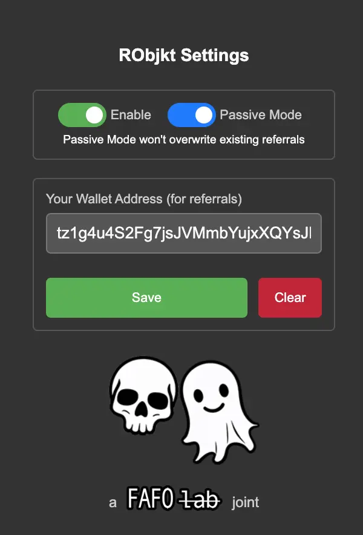

# RObjkt - RAID Objkt (A Referral Enhancer for Objkt.com)

[](LICENSE)

RObjkt (**RAID Objkt**) is a browser extension designed for the **TIAR (This Is A Raid)** community to **automatically set the TIAR raid wallet as the referrer** during NFT raids on [objkt.com](https://objkt.com). This ensures that **raids support the right wallet**, securing referral rewards for the community.

> **No Chrome Web Store listing yet, but it's coming soon!**  
> **Firefox support also coming soon.** 🔥

---

## ✨ Features

-   ✅ **Automatically applies the TIAR raid wallet** as the referrer during objkt.com raids.
-   ✅ **Ensures max referral rewards** are directed to the right place.
-   ✅ **Quick toggle ON/OFF** from the extension popup or toolbar.
-   ✅ **Manual wallet override available** for flexibility.
-   ✅ **Works instantly on all objkt.com pages** – No extra steps needed.
-   ✅ **Dark mode support** for a seamless experience.
-   ✅ **Lightweight & privacy-friendly** – No tracking, no ads, just pure functionality.

---

## 📥 Installation

### 🔹 **From Chrome Web Store (Coming Soon)**

1. **[Click here](#)** _(Link will be available soon)._
2. Click **"Add to Chrome"**.
3. Confirm by clicking **"Add Extension"**.

### 🔹 **Manual Installation (For Developers)**

1. **Download the latest release** from [GitHub](https://github.com/skullzarmy/RObjkt/releases/tag/v1.0.0).
2. Unzip the folder.
3. Open **Google Chrome** and go to `chrome://extensions/`.
4. Enable **Developer Mode** (toggle in the top right).
5. Click **Load Unpacked** and select the unzipped extension folder.
6. Done! 🎉

---

## 🔧 How to Use

1. **Click the RObjkt extension icon** in your browser toolbar.
2. **Enable/Disable** the extension using the toggle switch.
3. **Default mode:** The TIAR raid wallet is automatically applied as the referrer.
4. **Override mode:** Enter a custom Tezos wallet to use as the referral address.
5. Click **"Save"** – That’s it! The referral wallet will now be applied automatically during raids.
6. Need to turn it off? **Toggle the switch off anytime.**

---

## 📸 Screenshots

### Settings Preview



---

## 🛠️ Development & Contributions

Want to improve RObjkt? Contributions are welcome! 🎉

### 🔹 **Setup for Local Development**

1. Clone this repo:
    ```bash
    git clone https://github.com/your-repo-name.git
    ```
2. Open **Google Chrome** and go to `chrome://extensions/`.
3. Enable **Developer Mode**.
4. Click **Load Unpacked** and select the cloned extension folder.
5. Make your changes & test!

### 🔹 **Reporting Issues / Feature Requests**

-   Found a bug? Have a feature idea?  
    **Open an issue** in the [GitHub Issues](https://github.com/your-repo-name/issues).

---

## 🚀 Coming Soon

🔹 **Chrome Web Store Listing**  
🔹 **Firefox Support** _(Extensions for Mozilla are in the works!)_

---

## 📜 License

This project is licensed under the **MIT License**. See [LICENSE](LICENSE) for more details.

---

## ❤️ Credits

-   Built for the **TIAR (This IS A Raid) community** at [thisisaraid.xyz](https://thisisaraid.xyz).
-   Inspired by the need to **maximize referral rewards** during NFT raids on objkt.com.
-   Created by [**skllzrmy.tez**](https://github.com/skullzarmy).

---

🔹 **Ensure your referrals go to the right place during raids!**  
💬 Got questions? [Open an issue](https://github.com/your-repo-name/issues) or reach out on Twitter/Warpcast.
